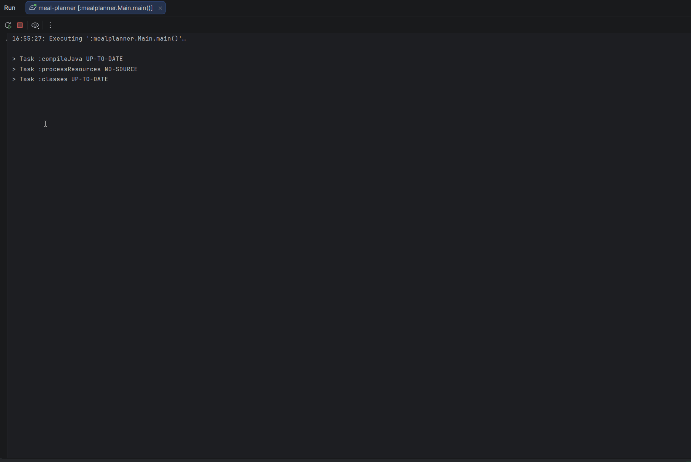

## Meal Planner


**Meal Planner** - консольное Java-приложение для планирования еженедельного питания и составления списка покупок. 
Проект разработан в рамках обучения на платформе [Hyperskill (JetBrains Academy)](https://hyperskill.org).

---
## Демо

---

## Краткое описание

### Приложение позволяет пользователю:
- Добавление блюд с указанием ингредиентов
- Просмотр блюд по категориям
- Планирование питания на каждый день недели
- Отображение недельного плана
- Создание и сохранение списка покупок в файл
- Хранение данных в базе данных PostgreSQL

### В рамках проекта реализовано:

- Проектирование структуры реляционной базы данных

- Работа с JDBC

- Использование SQL-запросов (JOIN, GROUP BY, ограничения UNIQUE)

- Разделение логики приложения (DAO-слой)

- Генерация файлов со списком покупок
---

## Используемые технологии
- Java 17
- JDBC
- PostgreSQL Database
- Gradle
---

## Структура проекта

- `Main` — взаимодействие с пользователем (консоль, ввод-вывод данных)
- `DAO` классы — логика работы с таблицами БД (сохранение/обновление/удаление данных)
- `DatabaseManager` — отвечает за подключение к БД и создание таблиц

---
## База данных

В проекте используется PostgreSQL.
База данных должна быть создана с именем `meals_db`.

### Таблицы:
- meals
- ingredients
- plan

---

## Как запустить

1. Клонировать репозиторий:
   ```bash
   git clone https://github.com/AnastasiaRyz/meal-planner.git
   cd meal-planner
   ```
2. Убедитесь, что PostgreSQL установлен и запущен.
3. Создайте базу данных с именем: 
    ````
    meals_db
    ````
4. При необходимости обновите учетные данные базы данных в файле:
    ````
    DatabaseManager.java
    ````
5. Запустите приложение:
    ````
    ./gradlew run
    ````
---
